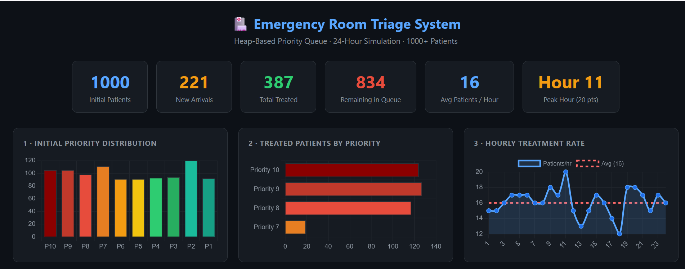
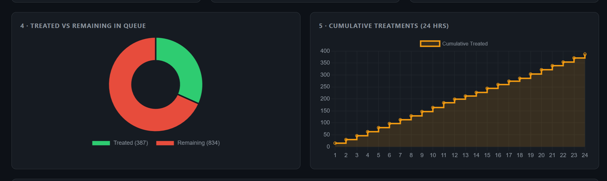
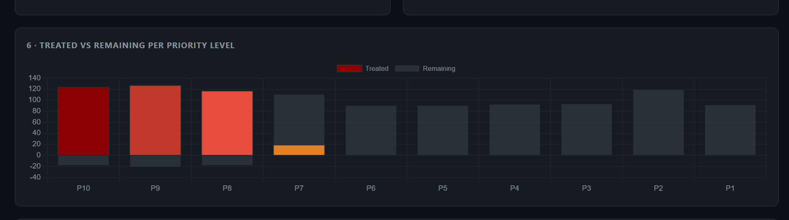
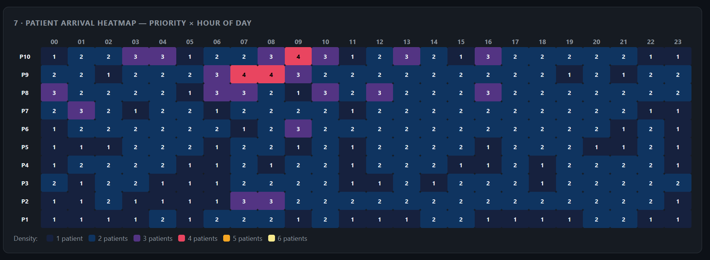
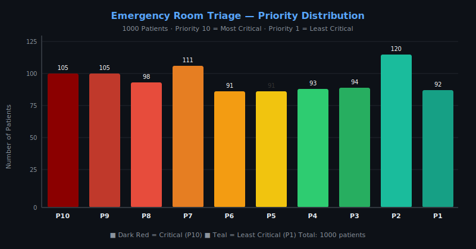
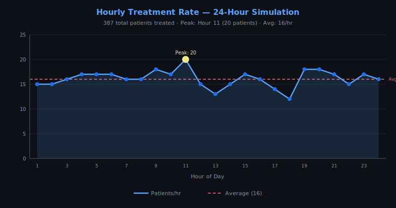

# Emergency Room Triage System
## Heap-Based Priority Queue Implementation

### Project Overview
This project implements an Emergency Room Triage System using a Max Heap priority queue. 
Patients are treated based on priority (10=Most Critical, 1=Least Critical) rather than 
arrival time, simulating real hospital triage systems.

### Course Information
- **Course:** Design and Analysis of Algorithms
- **Language:** Java
- **Data Structure:** Array-based Max Heap
- **Indexing:** Zero-based (Parent(i) = floor((i-1)/2))

### Features Implemented
- ✅ Array-based Max Heap with zero-based indexing
- ✅ insert() - O(log n)
- ✅ extractMax() - O(log n)  
- ✅ increasePriority() - O(log n)
- ✅ isEmpty() - O(1)
- ✅ maxHeapify() - O(log n)
- ✅ buildMaxHeap() - O(n) Floyd's Algorithm
- ✅ 1000+ synthetic patient dataset
- ✅ 24-hour ER simulation with random arrivals
- ✅ CSV input/output for all data
- ✅ Complete complexity analysis with proofs
- ✅ Real-world relevance discussion

### CSV Files Generated
| File | Description | Columns |
|------|-------------|---------|
| `data/patients.csv` | Initial 1000+ patients | PatientID, Priority, Hour, Minute, Second |
| `data/arrivals.csv` | New patients during simulation | PatientID, Priority, Hour, Minute, Second |
| `data/treatments.csv` | Complete treatment log | PatientID, Priority, ArrivalTime, TreatmentTime |
| `data/results.csv` | Final statistics | Statistics and hourly report |

### How to Compile and Run

#### Using Command Line:
```bash
# Navigate to project directory
cd EmergencyRoomTriage

# Compile
javac emergency/room/triage/system/EmergencyRoomTriage.java

# Run
java emergency.room.triage.system.EmergencyRoomTriage
```

---

### 📈 Simulation Statistics

| Metric | Value |
|--------|-------|
| Initial Patients | 1000 |
| New Arrivals | 221 |
| Total Treated | 387 |
| Remaining in Queue | 834 |
| Avg Patients / Hour | 16 |
| Peak Hour | Hour 11 (20 patients) |

**Treated by Priority:**

| Priority | Count | % of Treated |
|----------|-------|--------------|
| 10 — Most Critical | 124 | 32.0% |
| 9 | 127 | 32.8% |
| 8 | 117 | 30.2% |
| 7 | 19 | 4.9% |

> ✅ Priority 10 always treated before Priority 9, Priority 9 before Priority 8, and so on.  
> Same priority → earlier arrival treated first.

---

### 📊 Screenshots









**Priority Distribution Chart**



**Hourly Treatment Rate Chart**



> 🔗 Open [`dashboard.html`](dashboard.html) in your browser for fully interactive charts.
