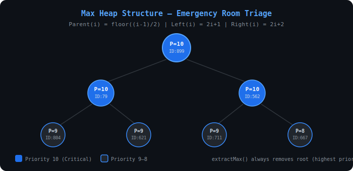
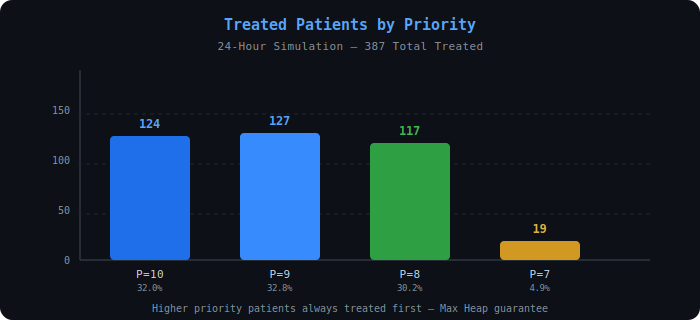
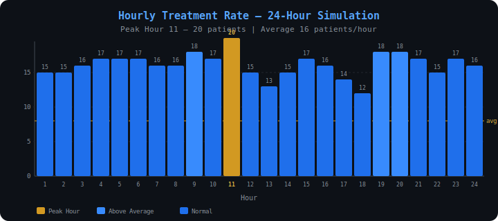
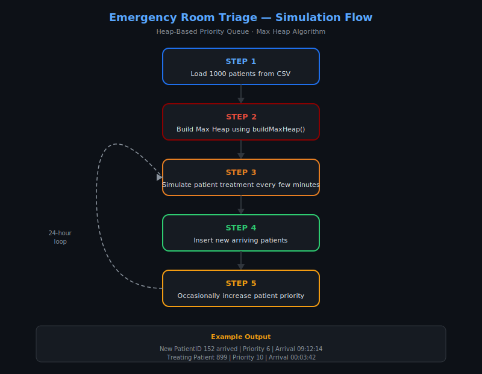

# Emergency Room Triage System
### Heap-Based Priority Queue — Medical Priority Scheduling

---

## Course Information

| Field | Detail |
|---|---|
| Course | Design and Analysis of Algorithms |
| University | Aksum University, AIT |
| Faculty | Faculty of Computing Technology |
| Department | Department of Computer Science |
| Language | Java |
| Data Structure | Array-based Max Heap |
| Indexing | Zero-based — `Parent(i) = floor((i-1)/2)` |

---

## Group Members

| No | Name | ID |
|----|------|----|
| 1 | Eyerusalem Teklay | Aku-1602682 |
| 2 | Shewit Legese | Aku-1602069 |
| 3 | Weldearegay Gebrey | Aku-1602148 |

---

## Problem Overview

In a real emergency room, patients cannot be treated in first-come-first-served order.
A patient with a minor injury must wait while a critically injured patient is treated immediately.

This system models that reality using a **Max Heap priority queue**:
- Priority **10** = Most Critical — treated first
- Priority **1** = Least Critical — treated last
- Ties in priority → earlier arrival time treated first

---

## Features Implemented

- ✅ Array-based Max Heap with zero-based indexing
- ✅ `insert()` — O(log n) bubble-up
- ✅ `extractMax()` — O(log n) remove root + heapify
- ✅ `increasePriority()` — O(log n) update + bubble-up
- ✅ `isEmpty()` — O(1)
- ✅ `maxHeapify()` — O(log n) down-heap traversal
- ✅ `buildMaxHeap()` — O(n) Floyd's Algorithm
- ✅ 1,000+ synthetic patient dataset
- ✅ 24-hour ER simulation with random arrivals
- ✅ Peak-hour arrival modelling (8am–8pm higher rate)
- ✅ Random priority escalation — simulates worsening conditions
- ✅ CSV input/output for all data
- ✅ Complete complexity analysis with proofs
- ✅ Real-world relevance discussion

---

## How to Compile and Run

```bash
# Compile
javac -d out src/ERTS/room/triage/EmergencyRoomTriage.java

# Run
java -cp out ERTS.room.triage.EmergencyRoomTriage
```

Or open in **NetBeans IDE** and press **Run Project** — build system pre-configured via `build.xml`.

---

## Simulation Statistics

| Metric | Value |
|---|---|
| Initial Patients | 1,000 |
| New Arrivals | 221 |
| Total Treated | 387 |
| Remaining in Queue | 834 |
| Avg Patients / Hour | 16 |
| Peak Hour | Hour 11 — 20 patients |

### Treated by Priority

| Priority | Count | % of Treated |
|---|---|---|
| 10 — Most Critical | 124 | 32.0% |
| 9 | 127 | 32.8% |
| 8 | 117 | 30.2% |
| 7 | 19 | 4.9% |

> ✅ Priority 10 always treated before Priority 9, Priority 9 before Priority 8, and so on.
> Same priority → earlier arrival treated first.

---

## Complexity Analysis

| Operation | Complexity | Notes |
|---|---|---|
| `insert()` | O(log n) | Bubble up heap height |
| `extractMax()` | O(log n) | Remove root + heapify down |
| `increasePriority()` | O(log n) | Update + bubble up |
| `maxHeapify()` | O(log n) | Down-heap traversal |
| `buildMaxHeap()` | O(n) | Floyd's algorithm |
| `isEmpty()` | O(1) | Check size variable |
| Space complexity | O(n) | Array storage |

---

## CSV Files Generated

| File | Description | Columns |
|---|---|---|
| `data/patients.csv` | Initial 1,000 patients | PatientID, Priority, Hour, Minute, Second |
| `data/arrivals.csv` | 221 new arrivals | PatientID, Priority, ArrivalHour, ArrivalMinute, ArrivalSecond |
| `data/treatments.csv` | 387 treatment records | PatientID, Priority, ArrivalTime, TreatmentTime |
| `data/results.csv` | Final statistics | Statistics and hourly report |

---

## Real-World Applications

- Emergency rooms treating critical patients first
- CPU process scheduling by priority
- Network packet routing (Quality of Service)
- Air traffic control sequencing
- Hospital resource allocation systems
- Disaster response triage coordination

---

## Screenshots

**Max Heap Structure**



**Treated Patients by Priority**



**Hourly Treatment Rate**



**Simulation Flow**



---

> See `docs/` for full requirements, design document, and implementation plan.

---

## 📄 Report

[AlgorithmReport-I1.pdf](AlgorithmReport-I1.pdf)

[View Full HTML Report](https://htmlpreview.github.io/?https://github.com/shewitalpha01-star/EMERGENCY-ROOM-TRAGE-SYSTEM/blob/main/docs/index.html)
